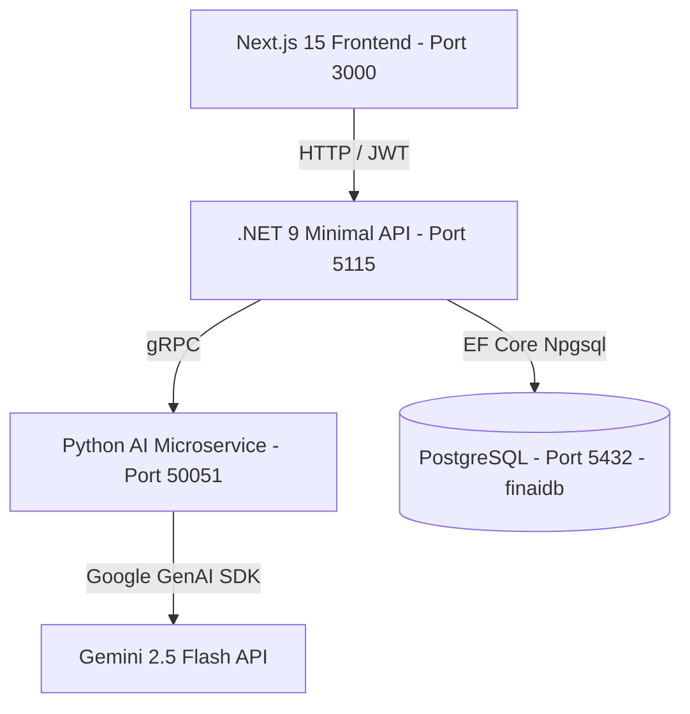

# FinAI - Proje Taşıma ve Kaldığı Yerden Devam Spesifikasyonu (Handover Spec)

Bu doküman, FinAI projesinin başka bir ortama (örneğin yeni bir Antigravity çalışma alanına) taşındığında **sıfır bağlam kaybıyla** ve **doğrudan sonraki geliştirme adımından** devam edilebilmesi için tüm teknik detayları ve yol haritasını içermektedir.

---

## 📌 1. Proje Özeti & Mimarisi

FinAI, doğal dille girilen finansal harcama ve gelir işlemlerini yapay zeka yardımıyla ayrıştırıp kategorize eden, PostgreSQL veritabanında saklayan, JWT ile güvenli oturum sağlayan ve Gemini 2.5 Flash tabanlı finansal analiz raporları ve öneriler üreten bir Kişisel Finans Yönetim (PFM) sistemidir.

### 🏗️ Hizmet Katmanları ve Çalışma Mimarisi


*   **Frontend (Next.js 15):** Dashboard, grafikler (Recharts), doğal dil çözümleme giriş alanı, işlem geçmişi ve JWT tabanlı kimlik doğrulama arayüzü (`/login`, `/register`).
*   **Backend (.NET 9 Minimal API):** JWT oluşturma ve doğrulama, PostgreSQL veri yönetimi, Python mikroservisi ile gRPC üzerinden haberleşme (`AiClientService`).
*   **AI & Microservice (Python 3.11):** Gemini 2.5 Flash modeline prompt atarak harcama verisi ayrıştırma (`ParseTransaction`) ve bütçe özet analizi (`GenerateFinancialInsight`).

---

## 🗂️ 2. Dosya Yapısı ve Önemli Konumlar

*   **Python gRPC Servisi:** `[src/ai_service/](file:///c:/Users/hakan/Documents/FinAI/src/ai_service)`
    *   `finai_service.proto`: gRPC kontratı.
    *   `server.py`: Gemini entegreli gRPC sunucusu (Port: 50051).
    *   `.env`: `GEMINI_API_KEY` değişkenini tutar.
*   **.NET Backend API:** `[backend/FinAI.Backend/](file:///c:/Users/hakan/Documents/FinAI/backend/FinAI.Backend)`
    *   `Program.cs`: Tüm minimal endpoint'ler, JWT yapılandırmaları ve bağımlılıklar.
    *   `Data/AppDbContext.cs`: PostgreSQL DbContext sınıfı.
    *   `Entities/User.cs` ve `Entities/Transaction.cs`: EF Core veri modelleri.
    *   `Services/AiClientService.cs`: gRPC client bağlantı sınıfı.
    *   `Services/PiiMaskingService.cs`: Hassas verileri maskelemek için regex tabanlı servis.
*   **Frontend UI:** `[frontend/](file:///c:/Users/hakan/Documents/FinAI/frontend)`
    *   `app/page.tsx`: Ana Dashboard arayüzü, grafikler ve AI sağlık raporu paneli.
    *   `app/login/page.tsx` & `app/register/page.tsx`: Giriş ve kayıt ekranları.

---

## ✅ 3. Tamamlanan Modüller & Mevcut Durum

1.  **JWT Tabanlı Auth Modülü:** `/api/auth/register` ve `/api/auth/login` endpoint'leri aktif. Şifreler BCrypt ile hash'leniyor.
2.  **gRPC AI Entegrasyonu:** `server.py` ve `AiClientService` entegrasyonu tamamlandı. Gemini 2.5 Flash ile Türkçe metin çözümleme ve kategori bazlı tavsiye üretme algoritmaları çalışıyor.
3.  **Veritabanı Entegrasyonu:** PostgreSQL bağlantısı EF Core üzerinden kuruldu, `Users` ve `Transactions` tabloları migrasyonları uygulandı.
4.  **UI & Dashboard:** Next.js 15 App Router üzerinde karanlık mod (Dark Mode) uyumlu modern arayüz hazır. Recharts tabanlı PieChart ve BarChart grafik verileri PostgreSQL'den canlı besleniyor.
5.  **Oturum Yönlendirmesi:** `page.tsx` üzerinde localStorage kontrolü ile oturumu olmayan kullanıcıların doğrudan `/login` sayfasına yönlendirilmesi ve checking state'i optimize edildi.

---

## 🟡 4. Hazır Durumda Bekleyen & Kısmen Eksik Alanlar

*   **PII Maskeleme (Veri Güvenliği):**
    *   Regex kurallarını barındıran `PiiMaskingService` backend içinde yazılmış durumdadır (`IPiiMaskingService`).
    *   **Eksik Kısım:** `Program.cs` içindeki `/api/parse-transaction` endpoint'inde bu servis henüz enjekte edilip çağrılmamıştır. Harcama metinleri doğrudan Gemini'ye gitmektedir. Bu entegrasyon sıradaki aşamalarda tamamlanmalıdır.

---

## 🎯 5. Gelecek Yol Haritası (Sıradaki Geliştirmeler)

### 🚀 AŞAMA 1: Bütçe Limiti & Ulaşılabilirlik Uyarıları (Budget Management) - *ÖNCELİKLİ*
Kullanıcıların harcama kategorilerine göre aylık bütçe limitleri koymasını ve limit aşımlarında görsel uyarı almasını sağlar.

#### 1. Backend Tarafı:
*   **`BudgetLimit` Entity'sinin Eklenmesi:**
    ```csharp
    public class BudgetLimit
    {
        public Guid Id { get; set; } = Guid.NewGuid();
        public Guid UserId { get; set; }
        public string Category { get; set; } = string.Empty; // Gıda, Ulaşım vb.
        public decimal LimitAmount { get; set; }
        public DateTime CreatedAt { get; set; } = DateTime.UtcNow;
        public DateTime UpdatedAt { get; set; } = DateTime.UtcNow;
        
        public User User { get; set; } = null!;
    }
    ```
*   **DbContext Güncelleme & Migration:** `AppDbContext` sınıfına `DbSet<BudgetLimit>` eklenecek ve `dotnet ef migrations add AddBudgetLimits` -> `dotnet ef database update` komutları çalıştırılacak.
*   **Endpoint Tasarımı:**
    *   `GET /api/budgets/{userId}`: Kullanıcının belirlediği limitleri getirir.
    *   `POST /api/budgets`: Yeni bir limit tanımlar veya var olanı günceller.
    *   `DELETE /api/budgets/{budgetId}`: Limit kaydını siler.
*   **Kategori Harcama Durumu DTO:** Bütçe durumunu (Kategori, Toplam Harcanan, Belirlenen Limit, Aşım Yüzdesi) dönen bir endpoint veya hesaplama mekanizması kurulabilir.

#### 2. Frontend Tarafı:
*   **Bütçe Yönetim Arayüzü:** Dashboard üzerinde veya ayrı bir modal penceresinde kategorilere göre limit belirleme formu (Input fields).
*   **Bütçe Durum Barları (Progress Bars):** Her kategorinin bütçe limitine kıyasla harcama oranını gösteren doluluk çubukları (Örn: Gıda: ₺4.200 / ₺5.000 - %84 doluluk).
*   **Anlık Aşım Uyarıları:**
    *   Limit doluluk oranı **%80 - %99** arasındaysa: Sarı uyarı ikonu ve mesajı (örn: "Gıda bütçenizin %80'ini aştınız!").
    *   Limit doluluk oranı **%100 ve üzerindeyse**: Kırmızı alarm mesajı (örn: "Eğlence bütçeniz tamamen tükendi!").

### 🚀 AŞAMA 2: PII Maskeleme Entegrasyonu
*   `backend/FinAI.Backend/Program.cs` dosyasındaki `/api/parse-transaction` endpoint'ine `IPiiMaskingService` enjekte edilmelidir.
*   Gemini API'ye gRPC ile istek atılmadan önce gelen raw text maskelenmeli, veritabanına ise orijinal veya maskelenmiş hali (tercihe göre) kaydedilmelidir.

### 🚀 AŞAMA 3: Toplu Banka Ekstresi İçe Aktarma (CSV Import)
*   Kullanıcıların banka ekstresi dosyalarını (CSV) yükleyerek tek seferde onlarca harcamayı yapay zekaya parse ettirip veritabanına topluca kaydetmesini sağlamak.

---

## 🛠️ 6. Kurulum ve Çalıştırma Adımları

Yeni ortama geçildiğinde projeyi başlatmak için şu adımları izleyin:

### 1. Python gRPC Servisi
1.  `src/ai_service` klasörüne gidin.
2.  Sanal ortamı aktifleştirin (`.venv\Scripts\activate` veya `.venv/bin/activate`).
3.  `.env` dosyasında `GEMINI_API_KEY` değerinin tanımlı olduğunu doğrulayın.
4.  Çalıştırın: `python server.py` (Port: `50051` üzerinde bekler).

### 2. .NET Backend API
1.  `backend/FinAI.Backend` klasörüne gidin.
2.  `appsettings.json` içindeki `DefaultConnection` PostgreSQL bağlantı dizesini düzenleyin.
3.  Veritabanı tablolarını oluşturmak için migrasyonları uygulayın:
    ```bash
    dotnet ef database update
    ```
4.  Çalıştırın: `dotnet run` (Port: `5115` üzerinde REST endpoints dinler).

### 3. Next.js 15 Frontend
1.  `frontend` klasörüne gidin.
2.  Paketleri kurun: `npm install`
3.  Geliştirici sunucusunu başlatın: `npm run dev` (Port: `3000` üzerinde açılır).
4.  Tarayıcıdan giriş yapın: `http://localhost:3000/register` adresinden kayıt olup sisteme dahil olabilirsiniz.

---

**Yeni Ortamdaki Asistana Komut:**
> *"Merhaba, `PROJECT_HANDOVER.md` dosyasındaki spesifikasyonlara göre projeyi kaldığı yerden devam ettirelim. İlk olarak **Aşama 1: Bütçe Limiti & Ulaşılabilirlik Uyarıları (Budget Limits)** modülünü backend tarafında Entity, DbContext ve API endpoint'lerini oluşturarak geliştirmeye başlayalım."*
