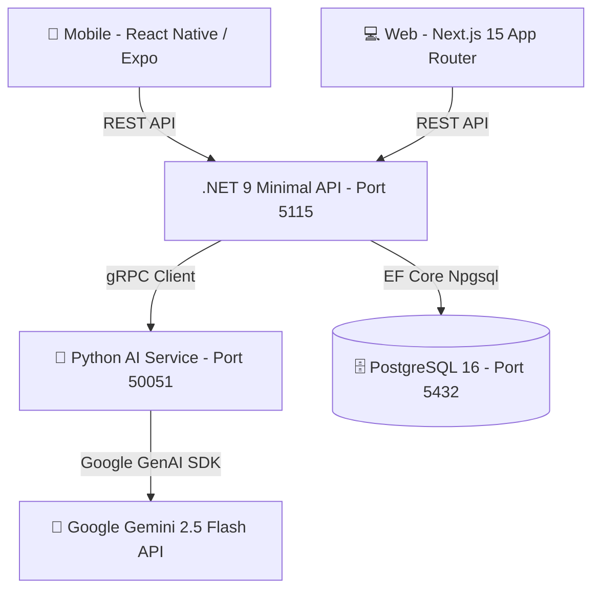

# 🚀 FinAI - Baştan Sona Proje Uygulama & İmplementasyon Dokümanı

Bu doküman, **FinAI (Yapay Zeka Destekli Kişisel Finans Yönetim Sistemi)** projesinin tüm mimarisini, katmanlarını, veritabanı şemasını, backend/frontend/mobil kod yapılarını ve yapay zeka entegrasyonlarını baştan sona eksiksiz bir şekilde açıklamaktadır.

---

## 📌 1. Proje Özeti ve Vizyonu

**FinAI**, kullanıcıların günlük finansal harcama ve gelirlerini doğal dille (örn: *"Marketten 450 TL gıda alışverişi yaptım"*) girmelerine olanak tanıyan, fiş fotoğraflarını yapay zeka ile okuyan (OCR), kategori bazlı bütçe limitleri koyan ve **Google Gemini 2.5 Flash** altyapısıyla kişiselleştirilmiş finansal danışmanlık sunan tam donanımlı bir Kişisel Finans Yönetim (PFM) platformudur.

### 🌟 Öne Çıkan Ana Yetenekler:
1. **Doğal Dil Harcama Çözümleme:** Serbest metinleri Gemini 2.5 Flash ile analiz edip otomatik tutar, kategori, mağaza adı ve işlem türü (Gider/Gelir) olarak ayrıştırma.
2. **Kamera İle Fiş OCR Analizi:** Fiş görsellerini Gemini Vision modeliyle okuyup mağaza adı, toplam tutar ve kalemleri otomatik tespit etme.
3. **Kişisel RAG Finans Danışmanı:** Kullanıcının canlı harcama verilerine ve hedeflerine göre özelleştirilmiş öneriler sunan AI sohbet botu.
4. **Bütçe & Limit Yönetimi:** Kategorilere göre aylık harcama limitleri tanımlama ve aşım uyarıları.
5. **Abonelik & Sabit Gider Takibi:** Tekrarlayan fatura ve abonelikleri otomatik tespit etme ve manuel yönetme.
6. **Birikim Hedefleri & AI Projeksiyonu:** Geleceğe dönük birikim hedefleri oluşturma ve hedefe ulaşma tarihi tahmini.

---

## 🏗️ 2. Sistem Mimarisi ve Teknoloji Yığını



### 🛠️ Kullanılan Teknolojiler:
* **Mobile App:** React Native, Expo SDK 54, React Navigation, Lucide Icons, AsyncStorage.
* **Web App:** Next.js 15 (App Router), React 19, TailwindCSS, Recharts, Lucide Icons.
* **Backend API:** .NET 9 Minimal API, Entity Framework Core 9, JWT Authentication, BCrypt.
* **AI Service:** Python 3.11, gRPC (`grpcio`), Google GenAI SDK (`google-genai`).
* **Veritabanı:** PostgreSQL 16 (Docker Container).
* **Güvenlik:** PII Masking (Hassas Veri Regex Gizleme), Rate Limiting (Gemini API Kota Koruması).

---

## 📂 3. Klasör Yapısı ve Modül Dağılımı

```text
FinAI/
├── 📂 backend/FinAI.Backend/     # .NET 9 Minimal API Katmanı
│   ├── 📄 Program.cs             # API Endpoint'leri ve Bağımlılık Enjeksiyonları
│   ├── 📂 Data/                  # AppDbContext (EF Core)
│   ├── 📂 Entities/              # Veritabanı Varlıkları (User, Transaction, Goal vb.)
│   └── 📂 Services/              # AiClientService (gRPC) & PiiMaskingService
│
├── 📂 src/ai_service/            # Python gRPC Yapay Zeka Mikroservisi
│   ├── 📄 server.py              # Gemini 2.5 Flash Entegreli gRPC Sunucusu
│   ├── 📄 finai_service.proto    # Protobuf gRPC Sözleşmesi
│   └── 📂 venv/                  # Python Sanal Ortamı
│
├── 📂 mobile/                    # React Native + Expo Mobil Uygulaması
│   ├── 📄 App.tsx                # Mobil Ana Giriş ve Navigasyon Kontrolü
│   ├── 📂 navigation/            # BottomTabNavigator
│   ├── 📂 screens/               # HomeScreen, ReceiptScan, Goals, Recurring, AiChat
│   └── 📂 services/api.ts        # Merkezi Fetch API Yapılandırması
│
├── 📂 frontend/                  # Next.js 15 Web Uygulaması
│   └── 📂 app/                   # Web Sayfaları (Dashboard, Login, Register)
│
├── 📄 docker-compose.yml         # PostgreSQL & Servis Docker Konfigürasyonu
└── 📄 PROJECT_HANDOVER.md        # Proje Devir Dokümanı
```

---

## ⚡ 4. Backend Katmanı İmplementasyonu (.NET 9 Minimal API)

Backend API `Program.cs` üzerinde minimal endpoint mimarisiyle kurulmuştur.

### 🔑 Ana Endpoint Haritası:
* **Kimlik Doğrulama:**
  * `POST /api/auth/register`: Kullanıcı kaydı (BCrypt ile şifre hash'leme).
  * `POST /api/auth/login`: JWT Access Token ve Refresh Token üretimi.
  * `POST /api/auth/refresh`: Token rotation yeteneği.
* **Harcamalar & AI:**
  * `POST /api/parse-transaction`: Doğal dil harcama ayrıştırma (PII maskeleme uygulayarak Python gRPC servisine gönderir ve PostgreSQL'e kaydeder).
  * `GET /api/transactions/{userId}`: Kullanıcının harcama geçmişini getirme.
  * `POST /api/receipts/upload`: Fiş görseli yükleme (hem JSON Base64 hem Multipart Form-Data destekli Gemini Vision OCR).
* **Bütçe & Abonelikler:**
  * `GET /api/budgets/summary/{userId}` & `POST /api/budgets`: Kategori limitleri ve harcama oranları.
  * `GET /api/recurring-transactions/{userId}` & `POST /api/recurring-transactions`: Sabit gider yönetimi.
* **AI Sohbet & Analiz:**
  * `POST /api/advisor/chat` (ve `/api/chat`): Gemini RAG destekli finans danışmanı sohbet endpoint'i.
  * `GET /api/insights/{userId}`: Bütçe durum raporu ve risk seviyesi analizi.

---

## 🤖 5. Yapay Zeka Katmanı İmplementasyonu (Python gRPC & Gemini)

`src/ai_service/server.py`, .NET backend ile **gRPC** protokolü üzerinden haberleşir ve **Google Gemini 2.5 Flash** modeline özel tasarlanmış prompt'lar gönderir:

1. **`ParseTransaction`:** Türkçe harcama metnini alır ve JSON formatında `{ intent, amount, category, merchant_or_title, confidence_score }` döner.
2. **`ExtractReceiptData`:** Fiş görselini byte dizisi olarak alır ve Gemini Vision ile mağaza adı, tutar ve ürün kalemlerini çıkarır.
3. **`ChatWithAdvisor`:** Kullanıcının canlı harcama özetlerini RAG bağlamı (context) olarak sistem talimatına ekler ve samimi, Türkçe finansal tavsiyeler üretir.
4. **`DetectRecurringPayments`:** Geçmiş harcamaları tarayarak tekrarlayan fatura ve abonelikleri otomatik tespit eder.

---

## 📱 6. Mobil Uygulama Katmanı (React Native + Expo)

Mobil arayüz karanlık mod (Dark Mode `#0f172a`) temalı modern ve akıcı bir kullanıcı deneyimi sunar:

* **Özet (`HomeScreen`):** Net bütçe durumu, toplam gelir/gider kartı, yapay zeka hızlı harcama ekleme input'u ve son işlemler listesi.
* **Fiş Tara (`ReceiptScanScreen`):** Kamera ile fotoğraf çekme veya galeriden fiş seçip Gemini Vision ile saniyeler içinde harcamaya dönüştürme.
* **Hedefler (`GoalsScreen`):** Birikim hedefleri oluşturma, para ekleme (deposit) ve AI ile ne zaman tamamlanacağını tahmin etme.
* **Giderler (`RecurringScreen`):** Aylık sabit taahhüt hesaplama, **`+` Yeni Abonelik Ekle** formu ve otomatik AI abonelik tespiti.
* **AI Asistan (`AiChatScreen`):** Canlı yapay zeka finans danışmanı ile chat arayüzü.

---

## 🗄️ 7. Veritabanı Şeması (PostgreSQL Varlıkları)

* `Users`: `Id`, `ExternalUserId`, `Email`, `Name`, `PasswordHash`, `IsAdmin`.
* `Transactions`: `Id`, `UserId`, `Intent`, `Amount`, `Category`, `MerchantOrTitle`, `RawText`, `ConfidenceScore`, `TransactionDate`, `CreatedAt`.
* `BudgetLimits`: `Id`, `UserId`, `Category`, `LimitAmount`, `CreatedAt`, `UpdatedAt`.
* `RecurringTransactions`: `Id`, `UserId`, `MerchantName`, `Amount`, `Category`, `Frequency`, `NextDueDate`, `IsActive`.
* `Goals`: `Id`, `UserId`, `Title`, `TargetAmount`, `CurrentAmount`, `Deadline`, `Category`, `Status`.
* `Receipts`: `Id`, `UserId`, `MerchantName`, `TotalAmount`, `Category`, `ExtractedDataJson`, `ConfidenceScore`, `Status`.

---

## 🛠️ 8. Projeyi Yerelde Çalıştırma Adımları

### 1. Veritabanını Başlatın (Docker)
```powershell
cd C:\Users\hakan\Documents\FinAI
docker compose up -d postgres
```

### 2. Python AI Servisini Başlatın
```powershell
cd C:\Users\hakan\Documents\FinAI\src\ai_service
.\venv\Scripts\activate
python server.py
```

### 3. .NET Backend API'yi Başlatın
```powershell
cd C:\Users\hakan\Documents\FinAI\backend\FinAI.Backend
dotnet run
```

### 4. Mobil Uygulamayı Başlatın (Expo)
```powershell
cd C:\Users\hakan\Documents\FinAI\mobile
npx expo start
```
*(Expo Go uygulamasıyla telefonunuzdan QR kodunu taratıp kullanabilirsiniz).*

---

*FinAI Projesi tam entegrasyonlu ve canlıya alınmaya hazır durumdadır!* 🚀
